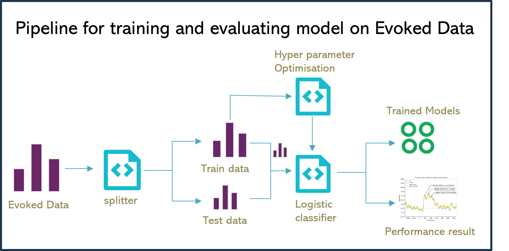
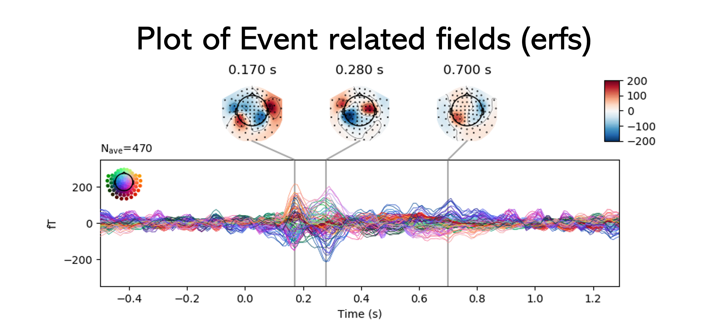

# MEG Sequence Classification using Machine Learning

This repository contains the code used for reproducing the results from the study
**"Magnetoencephalography (MEG) Sequence Classification using Machine Learning"**, which was my Research Project
at TU Dresden, done in collaboration with TU Bern (Switzerland) in the working group of 
[Athina Tzovara](https://neuro.inf.unibe.ch/menu/atzovara.html).
The project employs various machine learning techniques such as Logistic regression and SVM for the
4-class classification of MEG sequences collected from participants exposed to auditory sequences and silent periods.

## Table of Contents
- [Training pipeline](#training-pipeline)
- [Data Preprocessing](#data-preprocessing)
- [Visualization](#visualization)
- [Model Training and Testing](#model-training-and-testing)
- [Usage](#usage)
- [Dependencies](#dependencies)

## Training pipeline
The Evoked data, which is essentially the MEG sequence cut into 10 second clips, of all subjects are divided into training and
testing datasets. The division is subject-level ensuring no data leakage. Using the training dataset, we perform
hyperparameter optimisation to determine the best parameter of the ML model. Models are evaluated on the test dataset,
and performance in monitored into accuracy plots. The Trained models are then used for evaluation on the test dataset to
determine whether the model could classify the MEG sequence from the silent based on what category of sound was played earlier.



## Data Preprocessing
The MEG data collected from participants involves two conditions:
- **Task Period:** When participants were presented with sound sequences.
- **Silent Period:** When participants were sitting idle, after the sound recording ends.

Preprocessing involves resampling the data, artifact rejection, epoch creation, and visualization.

## Visualization
The project includes scripts for visualizing the topography of the MEG data,
plotting Event-Related Fields (ERF), and visualizing accuracy and heatmaps of predicted labels.



## Model Training and Testing
The machine learning models are trained using Logistic Regression, and SVM with cross-validation
and grid search employed to find the optimal hyperparameters.
Once trained, the models predict the probability of labels for silent data and generate accuracy curves.

## Usage
1. **Data Preparation:** Use `DataPreparation.py` and `DataPreparationSilent.py` to preprocess the MEG data.
2. **Visualization:** Run `DataVisualization.py` and `ErfPlots.py` to visualize data patterns.
3. **Hyperparameter Optimization:** Use `BestParameterFinder.py` to identify the best model parameters.
4. **Training and Testing:** Train the model using `TrainTest.py` and evaluate it with `AccuracyPlotter.py`.
5. **Prediction:** Use `PredictLabelProbability.py` to predict silent data probabilities.
6. **Heatmap Visualization:** Generate heatmaps with `HeatMapslabel.py`.

## Dependencies
The project relies on the following Python libraries:
- numpy
- pandas
- seaborn
- patsy
- scikit-learn
- matplotlib
- MNE (Magnetoencephalography data analysis)
- pickle

Install the dependencies using:
```bash
pip install numpy pandas seaborn scikit-learn matplotlib mne patsy
